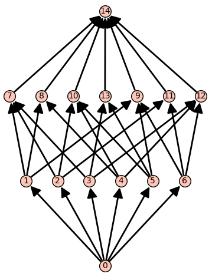
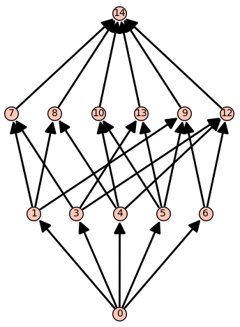
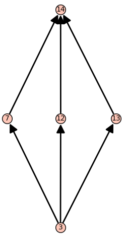

# Lattices

We include a class called `LatticeOfFlats`, which is associated with a hyperplane arrangement. This class keeps track of basic information we need to compute the various generating functions associated with a hyperplane arrangement. (For non-central arrangements, this is indeed not a lattice, but close to one.) All other functions are tied to the `LatticeOfFlats` class and, thus, are either attributes or methods. 

## LatticeOfFlats

**Input**:

- a hyperplane arrangement;
- `poset=None` : a finite poset;
- `flat_labels=None` : a dictionary from the elements of the poset to subsets of atoms;
- `hyperplane_labels=None` : a dictionary from the atoms of the poset to the hyperplanes.

**Output**: 

- the lattice of flats for the given hyperplane arrangement. 

Unless the poset and labels have been computed before, they should not be given as this function computes the intersection poset of a hyperplane arrangement faster than the default in SageMath.

### Attributes 

The lattice of flats has four attributes:

- `hyperplane_arrangement` : the given hyperplane arrangement;
- `poset` : the intersection poset;
- `flat_labels` : the dictionary indexed by the elements of `poset` with values given by subsets of the atoms of `poset`;
- `hyperplane_labels` : the dictionary indexed by the atoms of `poset` with values equal to the hyperplanes of `hyperplane_arrangement`.

#### Example (Lattice of braid arrangement)

We construct the lattice of flats for the braid arrangement in $\mathbb{R}^4$.

```python
sage: A = hi.CoxeterArrangement("A3")
sage: A
Arrangement of 6 hyperplanes of dimension 4 and rank 3
sage: L = hi.LatticeOfFlats(A)
sage: L
The lattice of flats of:
Arrangement of 6 hyperplanes of dimension 4 and rank 3
given by:
Finite poset containing 15 elements
```

Now we look at the data stored in the attributes. We display the hyperplanes in the arrangement.

```python
sage: L.hyperplane_arrangement
Arrangement of 6 hyperplanes of dimension 4 and rank 3
sage: L.hyperplane_arrangement.hyperplanes()
(Hyperplane 0*x0 + 0*x1 + x2 - x3 + 0,
 Hyperplane 0*x0 + x1 - x2 + 0*x3 + 0,
 Hyperplane 0*x0 + x1 + 0*x2 - x3 + 0,
 Hyperplane x0 - x1 + 0*x2 + 0*x3 + 0,
 Hyperplane x0 + 0*x1 - x2 + 0*x3 + 0,
 Hyperplane x0 + 0*x1 + 0*x2 - x3 + 0)
```

We display the poset as an image.

```python
sage: L.poset
Finite poset containing 15 elements
```



Instead of showing the entire dictionaries, we will evaluate them at a few points.

```python
sage: L.flat_labels[3]
{3}
sage: L.flat_labels[13]
{3, 5}
sage: L.flat_labels[9]
{1, 5, 6}
sage: L.flat_labels[0]
{}
```

We see that hyperplanes 1, 5, and 6 intersect in a codimension 2 subspace. 

```python
sage: L.hyperplane_labels[1]
Hyperplane 0*x0 + 0*x1 + x2 - x3 + 0
sage: L.hyperplane_labels[5]
Hyperplane x0 + 0*x1 - x2 + 0*x3 + 0
sage: L.hyperplane_labels[6]
Hyperplane x0 + 0*x1 + 0*x2 - x3 + 0
```

## .atoms

**Output**:

- the atoms of the underlying poset. 

## .deletion

**Input**:

- a hyperplane $H$.

**Output**:

- the lattice of flats associated to the arrangement without $H$.

#### Example (Deletion in the braid arrangement)

We continue the $\mathsf{A}_3$ example started [above](#example-lattice-of-braid-arrangement). We will delete the hyperplane labeled by $2$ and display the resulting lattice of flats. 

```python
sage: L.deletion(2)
The lattice of flats of:
Arrangement of 5 hyperplanes of dimension 4 and rank 3
given by:
Finite poset containing 13 elements
```



## .labels_of_flats

**Output**:

- the list of tuples with first entry an element of the poset and second entry a subset of atoms. 

## .labels_of_hyperplanes

**Output**:

- the list of tuples with first entry an element of the poset and second entry a hyperplane. 

## .Poincare_polynomial

**Output**:

- the Poincar&#233; polynomial of the hyperplane arrangement. 

## .proper_part_poset

**Output**:

- the subposet without $\hat{0}$ and $\hat{1}$.

## .show

No output given. This displays the underlying intersection poset using the default options in SageMath. This is a shortcut for `L.poset.show()`. 

## .subarrangement 

**Input**:

- an integer $x$.

**Output**:

- the lattice of flats of the interval $[\hat{0}, x]$. 

#### Example (Subarrangement of the braid arrangement)

We continue from the original $\mathsf{A}_3$ example started [above](#example-lattice-of-braid-arrangement). We will construct the subarrangement from the flat labeled $10$.

```python 
sage: L.subarrangement(10)
The lattice of flats of:
Arrangement <x1 - x2 | x0 - x1 | x0 - x2>
given by:
Finite poset containing 5 elements
```


## .restriction

**Input**:

- an integer $x$.

**Output**:

- the lattice of flats of the restriction to $x$ in the poset.

#### Example (Subarrangement of the braid arrangement)

We continue from the original $\mathsf{A}_3$ example started [above](#example-lattice-of-braid-arrangement). We will construct the restriction from the flat labeled $3$.

```python 
sage: L.restriction(3)
The lattice of flats of:
Arrangement <-x0 + x1 | x1 | x0>
given by:
Finite poset containing 5 elements
```


